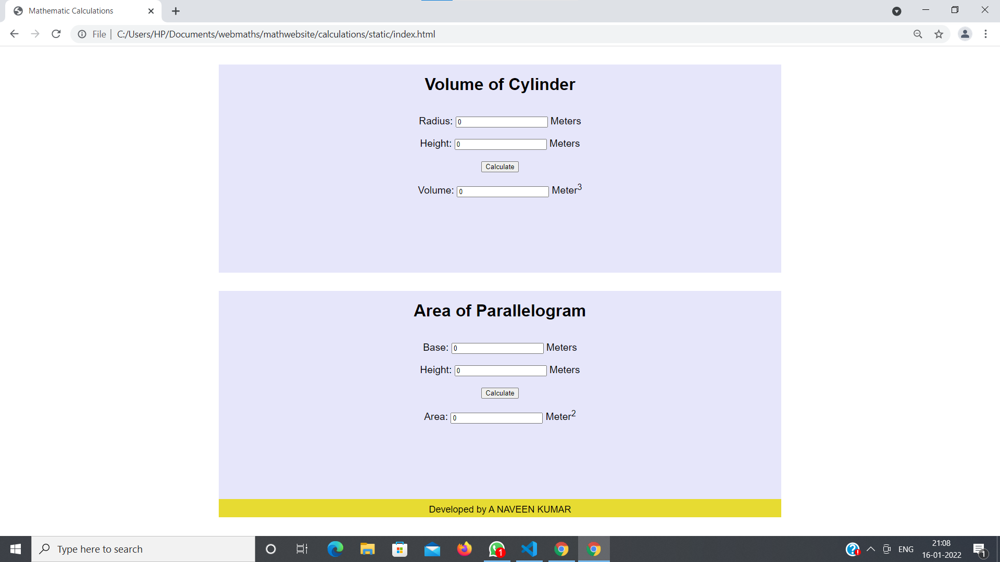

# Web Page for Mathematical Calculations

## AIM:

To design a static website with validation to perform mathematical calculations in client side.

## DESIGN STEPS:

### Step 1:

Requirement collection.

### Step 2:

Creating the layout using HTML and CSS.

### Step 3:

Write javascript to perform the calculations.

### Step 4:

Include regularexpression based input validation.

### Step 5:

Validate the layout in various browsers.

### Step 6:

Validate the HTML code.

### Step 6:

Publish the website in the given URL.

## PROGRAM :
```
<!DOCTYPE html>
<html lang="en">
<head>
    <meta charset="UTF-8">
    <meta http-equiv="X-UA-Compatible" content="IE=edge">
    <meta name="viewport" content="width=device-width, initial-scale=1.0">
    <title>Mathematic Calculations</title>
    <style>
        *{
  box-sizing: border-box;
  font-family: Arial, Helvetica, sans-serif;
}

body{
  background-color:white;
  color: black;
}

.container{
  width: 1080px;
  margin-left: auto;
  margin-right: auto;
}

.content{
  display: block;
  width: 100%;
  margin-left: auto;
  margin-right: auto;
  background-color: lavender;
  margin-top: 35px;
  min-height: 400px;
}

h1{
    color: black;
    text-align: center;
    padding-top: 20px;
}

.formelement{
    text-align: center;
    padding-top: 20px;
    font-size: larger;
}

.footer{
    display: inline-block;
    width: 100%;
    height: 35px;
    background-color: rgb(231, 219, 50);
    color: black;
    text-align: center;
    padding-top: 10px;
    font-size: large;
}

    </style>
</head>
<body>
    <div class="container">
        <div class="content">
            <h1>Volume of Cylinder</h1>
            <form>
                <div class="formelement">
                    <label for="redit">Radius:</label>
                    <input type="text" id="redit" value="0"/> Meters
                </div>
                <div class="formelement">
                    <label for="hedit">Height:</label> 
                    <input type="text" id="hedit" value="0"/> Meters
                </div>
                <div class="formelement">
                    <input type="button" value="Calculate" id="volbutton"/>
                </div>
                <div class="formelement">
                    <label for="cedit">Volume:</label> 
                    <input type="text" id="cedit" readonly value="0"/> Meter<sup>3</sup>
                </div>
            </form>
        </div>
    </div>
    <div class="container">
        <div class="content">
            <h1>Area of Parallelogram</h1>
            <form>
                <div class="formelement">
                    <label for="bedit">Base:</label>
                    <input type="text" id="bedit" value="0"/> Meters
                </div>
                <div class="formelement">
                    <label for="ledit">Height:</label>
                    <input type="text" id="ledit" value="0"/> Meters
                </div>
                <div class="formelement">
                    <input type="button" value="Calculate" id="areabutton"/>
                </div>
                <div class="formelement">
                    <label for="zedit">Area:</label>
                    <input type="text" id="zedit" readonly value="0"/> Meter<sup>2</sup>
                </div>
            </form>
        </div>
        <div class="footer">Developed by A NAVEEN KUMAR </div>
    </div>

<script>
    var button;
    button=document.querySelector("#volbutton");
    button.addEventListener("click",function(){
        var rtext,htext,ctext;
        var rval,hval,cval;
        var result,result1,rexp;
        rtext=document.querySelector("#redit");
        htext=document.querySelector("#hedit");
        ctext=document.querySelector("#cedit");

        rexp=new RegExp("^[1-9]+[0-9]*$");

        rval=rtext.value;
        result=rval.match(rexp);
        hval=htext.value;
        result1=hval.match(rexp);

        if(result==null)
        {
            alert("Please enter only positive integers for Radius");
        }
        if(result1==null)
        {
            alert("Please enter only positive integers for Height")
        }
        cval=22/7*rval*rval*hval;
        ctext.value=""+cval;

    });

    var button;
    button=document.querySelector("#areabutton");
    button.addEventListener("click",function(){
        var btext,ltext,ztext;
        var bval,lval,zval;
        var result2,result3,rexp1;
        btext=document.querySelector("#bedit");
        ltext=document.querySelector("#ledit");
        ztext=document.querySelector("#zedit");

        rexp1=new RegExp("^[1-9]+[0-9]*$");

        bval=btext.value;
        result2=bval.match(rexp1);
        lval=ltext.value;
        result3=lval.match(rexp1);

        if(result2==null)
        {
            alert("Please enter only positive integers for Base");
        }
        if(result3==null)
        {
            alert("Please enter only positive integers for Height");
        }
        zval=bval*lval;
        ztext.value=""+zval;

    });
</script>
</body>
</html>
```
## OUTPUT:



## Result:

Thus a website is designed to perform mathematical calculations in the client side.
